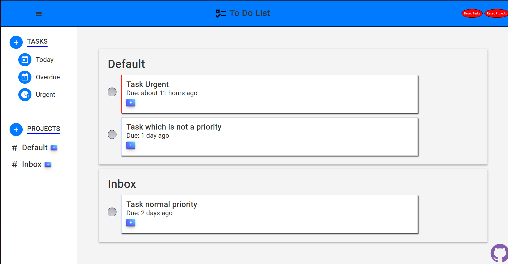

# To Do App

## Description
Little project to apply what I've learned of Html, CSS and javascript.

It was a project allowing the use of webpack to manage libraries but also apply pattern learned like pubsub using localstorage.

[Come see the live site](https://enumaoub.github.io/To-Do-List/)

## Working
I added a button allowing to auto populate with some tasks and projects.

With the sidebar we can create a project or a task, which is assigned to a project.\
For the task we can set
- its title, 
- a little description, 
- the priority
- its the due date.
<!-- -->
We could also filter the tasks shown, if overdue, due today or late, but also filter by project by clicking on the "#" next to the project.\
Finally, we have the list of current projects shown which like tasks can be edited.

